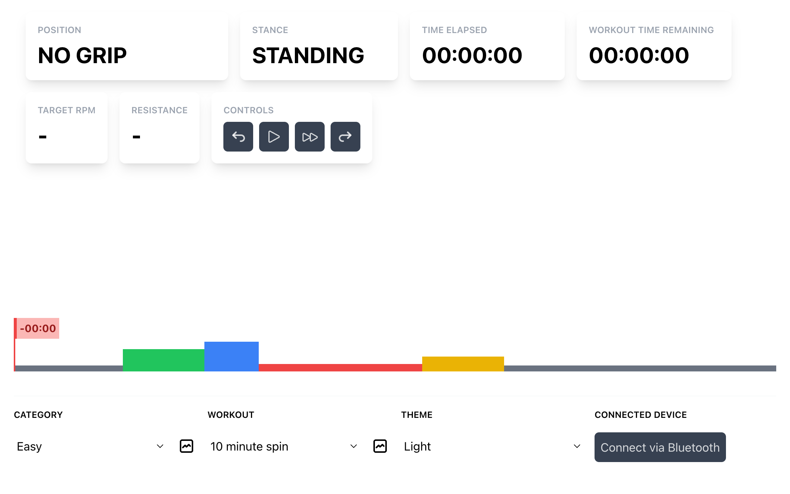

#  Simpleton - Spin Workouts


Web application made in Vue.js for use with a spin bike to DIY a Peloton-like experience on a phone, tablet, laptop or maybe even a pi!

Inspired after completing [James Montemagno's Sunny Health & Fitness SF-B1002 DIY Peloton](https://montemagno.com/building-an-at-home-diy-spin-bike-for-peloton-apple-fitness/) set-up.

Read about my home spin bike set-up, inspiration for this project, and how to use it on my blog post [Free Home DIY Spin Bike Setup](https://verringer.com/simpleton).

> [Click here to start using now!](https://verringer.github.io/simpleton)

## Features
- Free Spin Workouts
- No Subscriptions, Costs or Logins
- 10+ Included Themes
- Bluetooth Sensor Support (Cadence)
- Browser Based
- Wake Lock
- Open Source

## Usage
You can use it in-browser at [verringer.github.io/simpleton](https://verringer.github.io/simpleton)

Alternatively, clone the repo and run `npm run dev` to run locally with Vite.

## Themes

Simpleton comes with a bunch of themes included, here are a few examples in place of screenshots: 

| <br/>**Dark**                                | <br/>Light     |
|-----------------------------------------------------------------------------|------------------------------------------------|
| <br/><center>**Sigma - Light**</center> | <br/><center>**Computer**</center> |

*Plus 5 more including a fallout pip-boy theme!*

---
# Compatibility
Should work with all semi-modern browsers.

## Bluetooth Sensors
Designed and tested with [moofit CS9](https://www.amazon.co.uk/moofit-Bluetooth-Waterproof-Compatible-Openrider/dp/B0BHSJLRP7)

> Desktop: Compatibility for cadence / rpm sensors is far from perfect: [See CanIUse](https://caniuse.com/web-bluetooth]). Confirmed to be working on MacOS in Google Chrome, however Chromium based Opera is stated as working, but could not get it to work... YMMV.

> Android: Untested.

> iOS: Does not work in Safari, Bluefy, WebBLE sadly.

---

# Contributing

If you wish to add a theme, or a workout - please feel free to submit a PR.

For features - please raise a feature request issue first.

If you take inspiration from this, I'd love to hear! [@verringer](https://twitter.com/verringer)

## Adding Workouts
Workouts are all stored inside workouts/ in json format.

```
{
  "name": "Example Workout",
  "length": 60,
  "segments": [
    {
      "message": "Let's spin things up!",
      "rpm": 55,
      "resistance": 1,
      "duration": 60,
      "position": "2",
      "stance": "seated"
    },
  ]
}
```

You can add as many segments as you'd like, ensure length adds up to the sum of all segment durations.

All times are listed in seconds.

### Positions
Positions are used for how you should grip the handlebars.

There are a few different positions that are used in Spin classes. Here are the most common ones that you will see in this app.

All positions have an associated image, so if you add a new workout then you must make sure to use these names.

| Position | Description                                 | Image                                              | Config Key  |
|----------|---------------------------------------------|----------------------------------------------------|-------------|
| 0        | No grip - applicable to use with dumbbells  |           | 0 [Default] |
| 1        | Centre - for optimal adjustment knob access |    | 1           |
| 2        | Regular - as a normal bike                  |    | 2           |
| 2.5      | Wide - grip rear sides                      |  | 2.5         |
| 3        | Aero - grip front sides                     |    | 3           |

### Stances
Stances are used for how you should be positioned on the bike (sitting, standing etc).

There are a few different stances that are used in Spin classes. Here are the most common ones that you will see in this app.

| Stance | Description | Config Key |
|--------|-------------|-------- |
| Seated | Sitting on the bike | seated |
| Standing | Standing on the bike | standing |
| Hover  | Hovering over the seat | hover |

## Themes

Themes are built as variations in the `tailwind.config.js` file. To add a new theme, add the variant and then adjust the frontend templates to your liking.

I opted for this approach as it allows for "quick and dirty" full theming without having to write more than necessary.

## Development

A bit thrown together in areas, but it works. If you have any questions, feel free to ask. I do intend to clean up the codebase and make it more maintainable in the future, but for now I'm content with a working product and would rather spend the time actually using the app and workout out!

Project is built in `Vue.js` with `Vite`, utilises `TailwindCSS`. Also using `Tabler Vue` for icons.

File structure is pretty simple to understand (but will receive changes to be more standardized), here's some explanation:
    
```bash
src/
    actions / # JS functions for API's, etc.
    components/ # Reusable components
    widgets/ # Widgets for the workout screen
    workouts/index # Workout loader
    workouts/{category} # Workouts should be stored in categories
    App.vue # Main app file
```

## Testing

Please submit an issue if you have tested with browsers + bluetooth sensors not listed above in compatibility so that together we can build a compatibility list.

## Issues

If you have any issues, please submit an issue and I will try to get back to you as soon as possible.

---

# Future To-Do's
- [ ] Add more workouts
- [ ] Remove hard-coded duration from workout.json
- [ ] Add % remaining widget (and/or % completed)
- [ ] Controls could be improved
- [ ] Configurable settings to display different widgets
- [ ] Tooltip to compare to current section
- [ ] Ability to create workouts in app + load workouts from local
- [ ] Reset current workout progress on changing workout (possibly)
- [ ] Move body colours etc into a theme.css file using @apply for theming cleaner with tailwindcss
- [ ] Add HR sensor support, but I use Apple Watch and feel no need for this especially with how bad BLE compatibility is
- [ ] Chart device rpm after finishing session for comparison to target rpm in session. Think heart rate chart in Peloton app.

# Similar Links
https://codaris.github.io/UnderDeskBike/